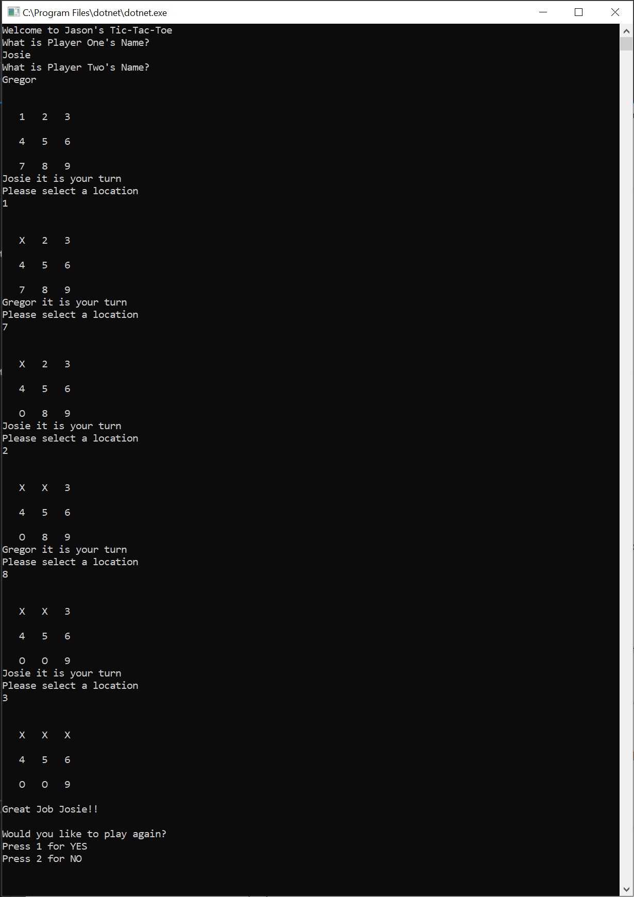

# Lab 04: Tic-Tac-Toe
 - Building off of your starter code provided from the class repo, complete the Tic Tac Toe logic.
   - Find the TODOs in the code (Hint: Go to your “view” menu and select “Task List”, This will show you all of your TODOs within the starter code) and add additional logic to accomplish each task.
   - Add summary comments above all of the methods that do not currently have summary comments. Be sure to explain what the main purpose of the method is, in addition to where it is being called/used. Identify the parameters and returns in the appropriate xml tags.
   - You’ve received reports from other users that there is a bug in the system! When a user selects a position on the board that is already marked, it is not prompting the user to retake their turn. It is up to You to find and fix this bug!
 
## Specs

### Guidance
- A Game board, to a user, looks like this:

    ##### 1 2 3
    ##### 4 5 6
    ##### 7 8 9

- The numbers in each of the squares will indicate the position number. Prompt the user to select which position they wish to play and then replace that position with either an X or an O.

- A winning board may look like this (O Wins!):

    ##### X X O
    ##### 4 O X
    ##### O X 9
- Remember that Tic-Tac-Toe is a 2 player game, so be sure to “switch” between players. Make it known to the user that their turn is over and it’s time for the next players turn. You will both play on the same board.

- Here is an outline for different classes that you have:

    - Game Board (this should construct/display the board after every turn with it’s new state)
    - Player (This will hold the players information such as name or marker, in addition to any actions that user may take)
    - Game (This would hold the actions of the game. )
- Be sure to check for a winner after each turn. Be aware that it is possible to have a tie/draw if no winner can be determined and all marks on the board are occupied.

- Stay within scope of this project. Please only use concepts and resources that we have covered so far in previous labs/lectures/assigned prework. If you are unsure if it is within scope, please ask a TA or instructor.

## Unit Tests
- Test that your app has the following functionality:
    - Given a game board, Test for winners
    - Test that there is a switch in players between turns
    - Confirm that the position the player inputs correlates to the correct index of the array
    - One other “unique” test of your own
## Example Usage
- When you run app.
    - Welcome to Jason's Tic-Tac-Toe
      - Asks for Player One Name (STRING INPUT)
      - Asks for Player Two Name (STRING INPUT)
      - Starts Game
        - Displays Game Board
        - Asks Player One To Make Move
        - Displays Game Board
        - Asks Player Two To Make Move
      - End of Game
        - Displays Board and Either Winner or Draw

    ## Screenshots of Usage
    
    
